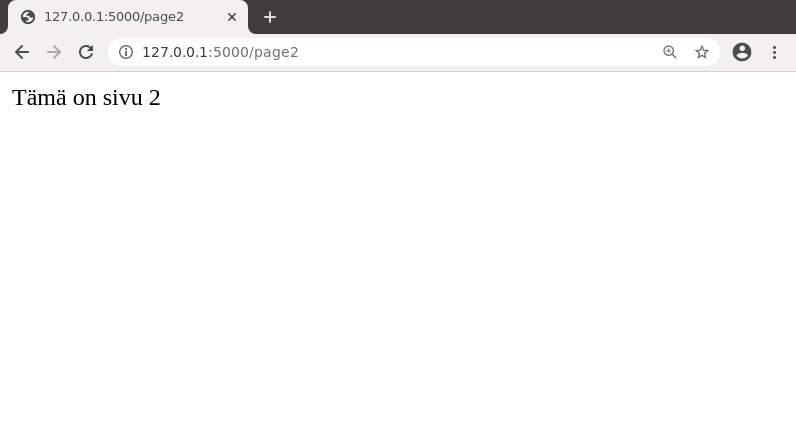
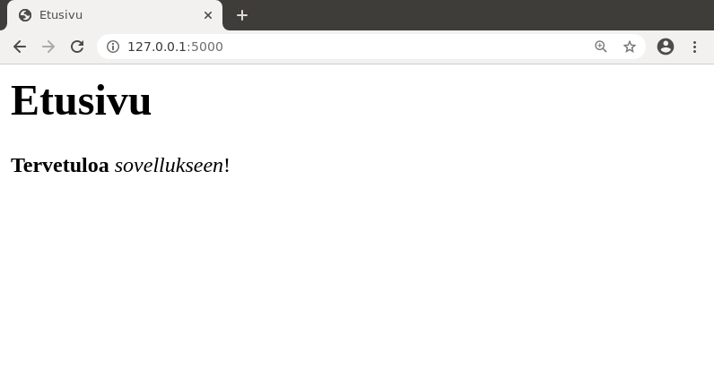

## Sivupyynnöt

Flask-kirjaston ideana on, että määrittelemme ohjelmassa funktioita, jotka käsittelevät sivupyyntöjä. Ennen funktion määrittelyä oleva _dekoraattori_ `@app.route` ilmaisee, mikä on sivun osoite, ja funktio palauttaa merkkijonona sivun sisällön.

Esimerkiksi voisimme laajentaa sovellusta niin, että siinä on kolme sivua:

```python
@app.route("/")
def index():
    return "Heipparallaa!"

@app.route("/page1")
def page1():
    return "Tämä on sivu 1"

@app.route("/page2")
def page2():
    return "Tämä on sivu 2"
```

Tässä sovelluksessa on etusivu, kuten ennenkin, sekä kaksi muuta sivua, joiden osoitteet ovat `page1` ja `page2`. Voimme katsoa sivuja näin:




Huomaa, että sivun osoite ja funktion nimi ovat kaksi eri asiaa. Sivun osoite annetaan dekoraattorissa, jonka jälkeen tulee sivupyynnön käsittelevä funktio, jolla voi olla muu nimi. Kuitenkin usein toimiva käytäntö on, että sivun osoite ja funktion nimi ovat samat, kuten yllä olevassa koodissa `page1` ja `page2`.

Koska sivun sisältö luodaan Pythonilla, voimme käyttää sivun luomisessa mitä tahansa ohjelmoinnin keinoja. Esimerkiksi seuraava funktio tuottaa sivun, jossa on luvut 1–100:

```python
@app.route("/test")
def test():
    content = ""
    for i in range(1,101):
        content += str(i)+" "
    return content
```

Funktion tuloksena on seuraava sivu:


Voimme myös määritellä sivun osoitteen niin, että siinä on _parametri_. Esimerkiksi seuraava funktio käsittelee sivuja, joiden osoitteessa on `int`-tyyppinen parametri `id`:

```python
@app.route("/page/<int:id>")
def page(id):
    return "Tämä on sivu "+str(id)
```

Sivun osoitteessa annettu parametri välittyy funktiolle, joka voi käyttää sitä haluamallaan tavalla sivun luomisessa. Tässä tapauksessa funktio näyttää sivulla viestin "Tämä on sivu _id_", eli esimerkiksi osoitteessa `page/123` oleva sivu näyttää tältä:


### HTML ja sivupohjat

Tähän mennessä olemme tuottaneet sivuja, joissa on pelkkää tekstiä,
mutta tarkemmin ottaen voimme käyttää sivuilla HTML-koodia. HTML on kieli, jolla määritellään nettisivun sisältö. Jos HTML ei ole sinulle ennestään tuttu, voit tutustua siihen [tästä](../../pages/html_opas.html).

Esimerkiksi seuraava sivu käyttää HTML-komentoja:

```python
@app.route("/")
def index():
    return "<b>Tervetuloa</b> <i>sovellukseen</i>!"
```

Tässä tapauksessa sana "Tervetuloa" näkyy lihavoituna ja sana "sovellukseen" näkyy kursivoituna:


Periaatteessa voisimme luoda sovelluksen sivujen HTML:n suoraan funktioissa, mutta  tämä olisi vaivalloista, kun sivulla on enemmän sisältöä. Parempi tapa on määritellä _sivupohjia_, joita funktiot käyttävät. Sivupohjat tallennetaan `templates`-hakemistoon.

Luodaan testiksi sivupohja `index.html`:

```html
<title>Etusivu</title>
<h1>Etusivu</h1>
<p><b>Tervetuloa</b> <i>sovellukseen</i>!</p>
```

Tämän jälkeen saamme näytettyä sivupohjan sisällön etusivulla näin:

```python
from flask import Flask
from flask import render_template

app = Flask(__name__)

@app.route("/")
def index():
    return render_template("index.html")
```

Tässä funktio `render_template` käsittelee sivupohjan sisällön. Tämä on yksi Flask-kirjaston funktioista, ja lisää tulee vastaan myöhemmin materiaalissa. Jotta tiettyä funktiota voi käyttää, se tulee ottaa mukaan `import`-rivillä.

Yllä oleva esimerkki tuottaa seuraavan sivun:



Flask käyttää käyttäjälle lähetettävien sivujen luomisessa Jinja-sivupohjia, jonka avulla valmiiseen sivupohjaan voi välittää tietoa Python-koodista. Seuraava esimerkki antaa näytteen asiasta:

```jinja
<title>Etusivu</title>
<h1>Etusivu</h1>
<p>{{ message }}</p>
<ul>

<li> {{ item }}

</ul>
```

Tässä sivun osaksi tulee parametrin `message` arvo sekä listan `list` alkiot HTML-listana. Voimme kutsua sivupohjaa vaikkapa näin:

```python
@app.route("/")
def index():
    words = ["apina","banaani","cembalo"]
    return render_template("index.html",message="Tervetuloa!",items=words)
```

Tämän seurauksena sivu näyttää tältä:


### Staattiset tiedostot

Staattiset tiedostot ovat sivuston osana olevia tiedostoja, joita ei luoda ohjelmallisesti. Esimerkiksi tavallisia staattisia tiedostoja ovat sivulla olevat kuvat.

Flaskissa suositeltu paikka sijoittaa staattiset tiedostot on hakemisto `static`. Esimerkiksi seuraava HTML-koodi näyttää hakemistossa olevan kuvan `kuva.png`:

```html

```
