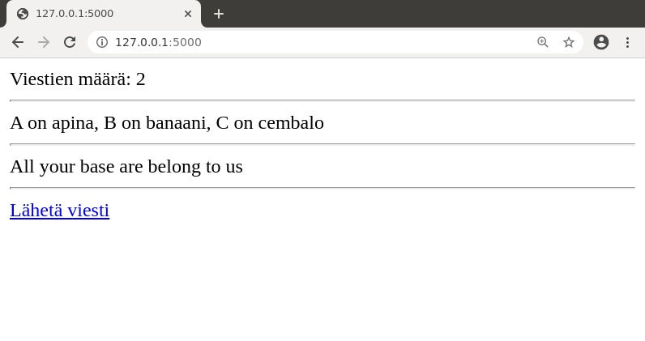
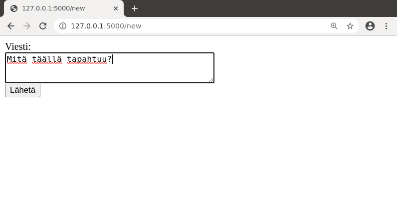
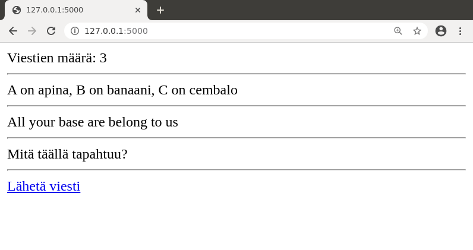

## Tietokannan käyttäminen

### PostgreSQL:n asennus

Jotta voit kehittää sovellusta, sinun täytyy asentaa koneellesi PostgreSQL-tietokanta.

Olemme tehneet kurssia varten [asennusskriptin](https://github.com/hy-tsoha/local-pg), joka asentaa PostgreSQL:n Linux-ympäristöön. Skripti asentaa tietokannan käyttäjän kotihakemistoon niin, että asennus ei vaadi pääkäyttäjän oikeuksia eikä tietokanta ole muiden käyttäjien käytettävissä. Skripti on tarkoitettu erityisesti käytettäväksi tietojenkäsittelytieteen osaston fuksiläppäreissä ja mikroluokissa.

Jos sinulla on ongelmia asennusskriptin kanssa, voit katsoa [videon](https://www.helsinki.fi/fi/unitube/video/617d690b-b1ce-44f0-997a-dca01bf7eff0), joka näyttää asennuksen vaiheet sekä sen jälkeen esimerkin tietokannan käyttämisestä.

Voit myös asentaa PostgreSQL:n pääkäyttäjänä käyttöjärjestelmäsi pakettienhallinnan kautta, käyttää Dockeria tai vastaavaa alustaa tai ladata asennuspaketin itse. Ohjeita asennukseen eri järjestelmiin on [PostgreSQL:n sivulla](https://www.postgresql.org/download/).

Macilla helppo tapa saada PostgreSQL käyttöön on [Postgres.app](https://postgresapp.com/).

### PostgreSQL-tulkki

Tietokannan asennuksen jälkeen komento `psql` avaa PostgreSQL-tulkin, jonka avulla voi suorittaa SQL-komentoja komentorivillä. Esimerkiksi voimme luoda seuraavasti taulun `messages`, lisätä sinne kolme riviä ja hakea sitten kaikki rivit taulusta:

```prompt
$ psql
user=# CREATE TABLE messages (id SERIAL PRIMARY KEY, content TEXT);
CREATE TABLE
user=# INSERT INTO messages (content) VALUES ('moikka');
INSERT 0 1
user=# INSERT INTO messages (content) VALUES ('apina banaani cembalo');
INSERT 0 1
user=# INSERT INTO messages (content) VALUES ('kolmas viesti');
INSERT 0 1
user=# SELECT * FROM messages;
 id |        content        
----+-----------------------
  1 | moikka
  2 | apina banaani cembalo
  3 | kolmas viesti
(3 rows)
```

Rivien alussa oleva `user` on tietokoneen käyttäjän tunnus, jonka kautta tietokantaa käytetään. Tässä materiaalissa käytetään esimerkkinä tunnusta `user`, mutta omalla koneellasi se on todennäköisesti jokin muu.

PostgreSQL:ssä tyyppi `SERIAL` tarkoittaa taulun avaimena käytettävää kokonaislukua, joka kasvaa automaattisesti, kun tauluun lisätään uusia rivejä.

Hyödyllisiä PostgreSQL-tulkin komentoja ovat `\dt`, joka näyttää listan tauluista, sekä `\d [taulu]`, joka näyttää taulun sarakkeet ja muuta tietoa siitä.

```prompt
user=# \dt
         List of relations
 Schema |   Name   | Type  | Owner 
--------+----------+-------+-------
 public | messages | table | user
(1 row)

user=# \d messages
                             Table "public.messages"
 Column  |  Type   | Collation | Nullable |               Default                
---------+---------+-----------+----------+--------------------------------------
 id      | integer |           | not null | nextval('messages_id_seq'::regclass)
 content | text    |           |          | 
Indexes:
    "messages_pkey" PRIMARY KEY, btree (id)
```

Komento `\q` poistuu PostgreSQL-tulkista:

```prompt
user=# \q
$ 
```

### Tietokantayhteys sovelluksesta

Jotta voimme käyttää tietokantaa Flask-sovelluksessa, asennamme pari kirjastoa lisää:

```prompt
(venv) $ pip install flask-sqlalchemy
(venv) $ pip install psycopg2
```

Ensimmäinen kirjasto `flask-sqlalchemy` on SQLAlchemy-rajapinta, jonka kautta voi käyttää tietokantaa Flaskissa. Toinen kirjasto `psycopg2` puolestaan mahdollistaa yhteyden muodostamisen PostgreSQL-tietokantaan.

Jos jälkimmäinen komento ei toimi, voit kokeilla korvata nimen `psycopg2` nimellä `psycopg2-binary`. Tätä ennen kannattaa kuitenkin yrittää ratkaista mahdolliset ongelmat muuten, esimerkiksi Macin käyttäjille on neuvoja [tässä Stackoverflown kysymyksessä](https://stackoverflow.com/questions/33866695/install-psycopg2-on-mac-osx-10-9-5).

Jotta sovellus saa yhteyden tietokantaan, sen täytyy tietää tietokannan _osoite_. Tässä materiaalissa käytämme osoitetta muodossa `postgresql:///user`, missä `user` on käytettävän tietokannan nimi ja näkyy myös PostgreSQL-tulkissa rivien alussa. Tietokannan nimi on siis tässä sama kuin käyttäjän tunnus.

Huomaa, että [vaadittu tapa antaa tietokannan osoite (URI)](https://www.postgresql.org/docs/12/libpq-connect.html#LIBPQ-CONNSTRING) voi olla vähän erilainen riippuen siitä, miten tietokantaan otetaan yhteys.

Seuraavassa on yksinkertainen sovellus, joka testaa tietokantayhteyttä. Sovellus olettaa, että tietokannassa on äsken luomamme `messages`-taulu.

<p class="code-title">app.py</p>
```python
from flask import Flask
from flask import redirect, render_template, request
from flask_sqlalchemy import SQLAlchemy

app = Flask(__name__)
app.config["SQLALCHEMY_DATABASE_URI"] = "postgresql:///user"
db = SQLAlchemy(app)

@app.route("/")
def index():
    result = db.session.execute("SELECT COUNT(*) FROM messages")
    count = result.fetchone()[0]
    result = db.session.execute("SELECT content FROM messages")
    messages = result.fetchall()
    return render_template("index.html", count=count, messages=messages) 

@app.route("/new")
def new():
    return render_template("new.html")

@app.route("/send", methods=["POST"])
def send():
    content = request.form["content"]
    sql = "INSERT INTO messages (content) VALUES (:content)"
    db.session.execute(sql, {"content":content})
    db.session.commit()
    return redirect("/")
```

<p class="code-title">index.html</p>
```jinja
Viestien määrä: {{ count }}
<hr>

{{ message[0] }}
<hr>

<a href="/new">Lähetä viesti</a>
```

<p class="code-title">new.html</p>
```html
<form action="/send" method="POST">
Viesti: <br>
<textarea name="content" rows="3" cols="40"></textarea>
<br>
<input type="submit" value="Lähetä">
</form>
```

Sovelluksen käyttäminen voi näyttää tältä:







Katsotaan vielä tarkemmin joitakin kohtia koodista:

```python
app.config["SQLALCHEMY_DATABASE_URI"] = "postgresql:///user"
db = SQLAlchemy(app)
```

Tämä koodi määrittelee osoitteen, jonka kautta tietokantaan saadaan yhteys, sekä luo `db`-olion, jonka avulla sovellus voi suorittaa SQL-komentoja.

```python
    result = db.session.execute("SELECT COUNT(*) FROM messages")
    count = result.fetchone()[0]
```

Tämä kysely tuottaa tulostaulun, jossa on yksi rivi: funktion `COUNT(*)` palauttama taulun rivien määrä. Metodi `fetchone` hakee rivin sisällön tuplena ja kohta 0 viittaa ensimmäiseen (tässä tapauksessa ainoaan) sarakkeeseen, jossa on rivien määrä.

```python
    result = db.session.execute("SELECT content FROM messages")
    messages = result.fetchall()
```

Tämä kysely hakee sisällön kaikista taulussa olevista viesteistä. Metodi `fetchall` antaa listan, jossa on kunkin rivin sisältö tuplena. Sivupohjassa `message[0]` näyttää rivin ensimmäisen sarakkeen arvon eli viestin sisällön.

```python
    sql = "INSERT INTO messages (content) VALUES (:content)"
    db.session.execute(sql, {"content":content})
    db.session.commit()
    return redirect("/")
```

Tämä koodi lisää tietokantaan uuden rivin, kun käyttäjä on lähettänyt viestin lomakkeella.

Käyttäjän antama syöte yhdistetään SQL-komentoon parametrina, jolla on tietty nimi, tässä tapauksessa `content`. SQL-komennossa ennen parametrin nimeä on kaksoispiste.

Huomaa, että sovelluksen tekemät SQL-komennot suoritetaan automaattisesti transaktion sisällä. Kun sovellus tekee muutoksia tietokantaan, muutosten jälkeen täytyy kutsua metodia `commit`, jotta transaktio viedään loppuun ja muutokset menevät pysyvästi tietokantaan.

Funktio `redirect` aiheuttaa uudelleenohjauksen toiselle sivulle. Tässä tapauksessa viestin lähetyksen jälkeen siirrytään takaisin etusivulle.

### Ympäristömuuttujat

Käytännössä ei ole hyvä tapa kovakoodata tietokannan osoitetta sovelluksen koodiin, vaan parempi tapa on välittää tämä tieto _ympäristömuuttujan_ kautta. Tässä tapauksessa voimme päättää, että ympäristömuuttuja `DATABASE_URL` ilmaisee tietokannan osoitteen.

Yksi tapa määritellä ympäristömuuttuja olisi käyttää komentoa `export` seuraavasti ennen sovelluksen käynnistämistä:

```prompt
(venv) $ export DATABASE_URL=postgresql:///user
(venv) $ flask run
```

Kuitenkin kätevämpi tapa on ottaa käyttöön kirjasto `python-dotenv`:

```prompt
(venv) $ pip install python-dotenv
```

Kun kirjasto on asennettu, Flask osaa käyttää sitä automaattisesti. Tämän ansiosta voimme luoda tiedoston `.env`, jossa on määritelty ympäristömuuttujat:

```
DATABASE_URL=postgresql:///user
```

Tämän etuna on, että ennen sovelluksen käynnistämistä ei tarvitse suorittaa `export`-komentoa vaan ympäristömuuttujat ovat aina tallessa tiedostossa.

Voimme hakea ympäristömuuttujan arvon sovellukseen näin:

```python
from os import getenv

app.config["SQLALCHEMY_DATABASE_URI"] = getenv("DATABASE_URL")
```

Tästä lähtien oletamme, että ympäristömuuttuja `DATABASE_URL` kertoo tietokannan osoitteen. Tämä tieto voi olla ympäristöstä riippuen tiedostossa `.env` tai määritetty muulla tavalla.

### SQLAlchemyn varoitus

Kun sovelluksessa käytetään tietokantaa SQLAlchemyn kautta, sovelluksen käynnistäminen saattaa antaa seuraavan varoituksen:

```prompt
FSADeprecationWarning: SQLALCHEMY_TRACK_MODIFICATIONS adds significant overhead and will be disabled by default in the future.  Set it to True or False to suppress this warning.
```

Tässä projektissa tämä ei haittaa sinänsä, mutta jos haluat päästä varoituksesta eroon, voit lisätä koodiin seuraavan rivin:

```python
app.config["SQLALCHEMY_TRACK_MODIFICATIONS"] = False
```

Lisää tietoa varoituksen syystä löydät [Stack Overflow'n keskustelusta](https://stackoverflow.com/questions/33738467/how-do-i-know-if-i-can-disable-sqlalchemy-track-modifications).
