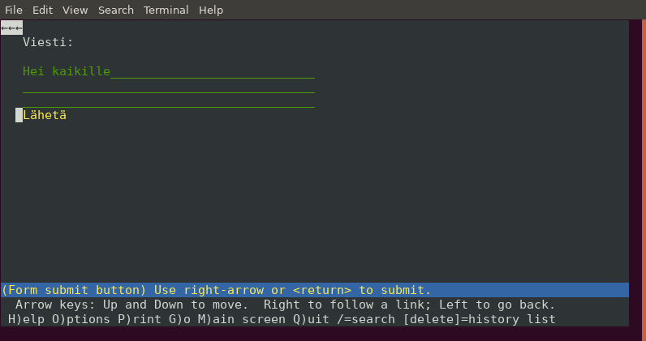

## Käytettävyys

Sovelluksen toimivuuden lisäksi on tärkeää, että sitä on mukavaa käyttää. Tähän kuuluu mm. seuraavia asioita:

* Sivut latautuvat nopeasti ja sovellus reagoi välittömästi, kun käyttäjä siirtyy sivulta toiselle tai lähettää lomakkeen.
* Käyttäjälle on selvää, mitä sovelluksen toiminnot tekevät ja miten niitä on tarkoitus käyttää.
* Kun käyttäjä suorittaa toiminnon, sovellus joko näyttää selkeästi, että toiminto onnistui, tai näyttää ymmärrettävän virheilmoituksen.
* Sovellus toimii eri selaimilla ja eri laitteissa ja olettaa mahdollisimman vähän käyttäjän ympäristöstä.
* Sovellusta pystyy käyttämään hyvin myös silloin, kun tietokannassa on paljon tietoa (usein sovellusta kehitettäessä tietoa on vain vähän).

Verkossa on paljon sekä hyvin että huonosti toimivia sovelluksia. Hyvin toimivat sovellukset soveltuvat oman sovelluksen esikuviksi, kun taas huonosti toimivat sovellukset muistuttavat siitä, mitä virheitä kannattaa varoa omassa sovelluksessa.

Hyvä tulikoe sovellukselle on kokeilla jossain vaiheessa sen toimintaa tekstiselaimessa. Esimerkiksi osassa 3 tehty keskustelusovellus näyttää seuraavalta Lynx-selaimessa:

Tässä tapauksessa sovellusta pystyy käyttämään hyvin tekstiselaimessa, mikä on merkki siitä, että se toimii hyvin monenlaisissa ympäristöissä. Usein tähän tavoitteeseen päästään automaattisesti toteuttamalla sivut suoraviivaisella HTML:llä, jossa elementtejä on käytetty niiden merkityksen mukaisesti.

_Saavutettava_ sovellus on sellainen, jonka suunnittelussa on otettu huomioon eri käyttäjäryhmät. Esimerkiksi näkövammaiset käyttävät ohjelmia, jotka lukevat ääneen verkkosivujen sisältöä, jolloin on tärkeää, että oleellinen sisältö on saatavilla tekstimuodossa ja HTML-elementtejä on käytetty loogisesti. Lisää tietoa asiasta löydät [Ronja Ojan materiaalista](https://ronjao.github.io/Saavutettavuus/).