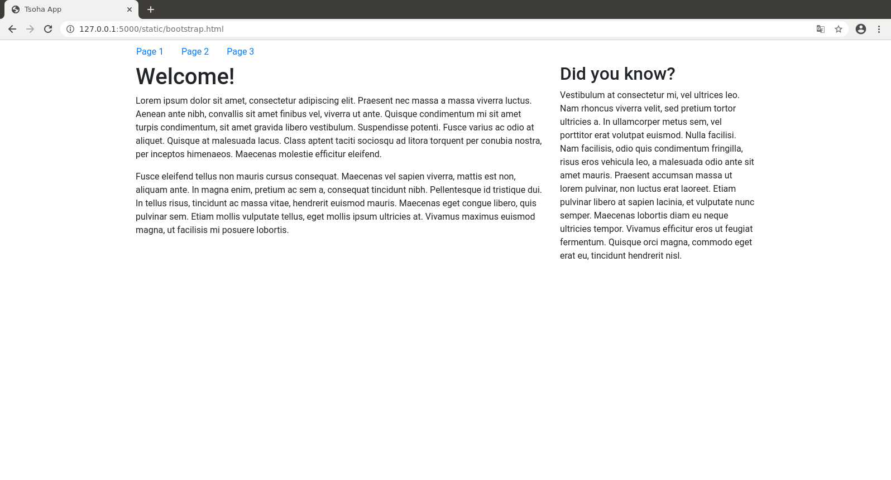
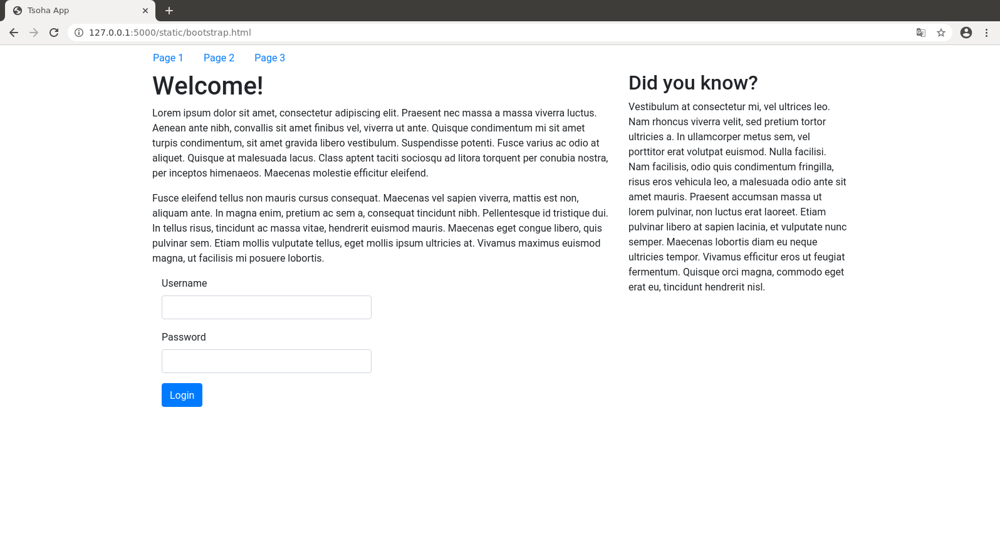

# Ulkoasu Bootstrapilla

Yksi tapa luoda sovelluksen ulkoasu on käyttää valmista ulkoasukirjastoa. Näistä varmaankin eniten käytetty on [Bootstrap](https://getbootstrap.com/), mutta hyviä vaihtoehtoja on useita.

Bootstrap tarjoaa suuren joukon komponentteja ulkoasun rakentamiseen. Tutustumme tässä joihinkin niistä, ja lisää tietoa on Bootstrapin [dokumentaatiossa](https://getbootstrap.com/docs/4.5/getting-started/introduction/).

## Vaihe 1: sivupohja

Bootstrapin saa helpoiten käyttöön lisäämällä sivulle seuraavan rivin:

```html
<link rel="stylesheet" href="https://stackpath.bootstrapcdn.com/bootstrap/4.5.0/css/bootstrap.min.css">
```

Tämä rivi hakee Bootstrapin kirjastotiedoston sisällönjakeluverkon (CDN) kautta. Koska Bootstrap on usein käytetty kirjasto, tämä tiedosto voi olla jo valmiina käyttäjän selaimen välimuistissa, mikä nopeuttaa sivun latautumista.

Tehdään ensin sivupohja Bootstrapin [grid-systeemin](https://getbootstrap.com/docs/4.5/layout/grid/) avulla. Ideana on, että sivun sisältöosa on jaettu 12 osaan ja luomme kaksi palstaa, joista vasen vie tilaa 8 osaa ja oikea vie tilaa 4 osaa.

Sivulla oleva esimerkkiteksti on tuotettu [lorem ipsum -generaattorin](https://www.lipsum.com/) avulla.

```html
<!doctype html>
<meta name="viewport" content="width=device-width, initial-scale=1, shrink-to-fit=no">
<link rel="stylesheet" href="https://stackpath.bootstrapcdn.com/bootstrap/4.5.0/css/bootstrap.min.css">
<title>Tsoha App</title>
<div class="container">
  <div class="row">
    <div class="col-8">
      <h1>Welcome!</h1>
      <p>
        Lorem ipsum dolor sit amet, consectetur adipiscing elit. Praesent nec massa a massa viverra luctus. Aenean ante nibh, convallis sit amet finibus vel, viverra ut ante. Quisque condimentum mi sit amet turpis condimentum, sit amet gravida libero vestibulum. Suspendisse potenti. Fusce varius ac odio at aliquet. Quisque at malesuada lacus. Class aptent taciti sociosqu ad litora torquent per conubia nostra, per inceptos himenaeos. Maecenas molestie efficitur eleifend.
      <p>
        Fusce eleifend tellus non mauris cursus consequat. Maecenas vel sapien viverra, mattis est non, aliquam ante. In magna enim, pretium ac sem a, consequat tincidunt nibh. Pellentesque id tristique dui. In tellus risus, tincidunt ac massa vitae, hendrerit euismod mauris. Maecenas eget congue libero, quis pulvinar sem. Etiam mollis vulputate tellus, eget mollis ipsum ultricies at. Vivamus maximus euismod magna, ut facilisis mi posuere lobortis.
    </div>
    <div class="col-4">
      <h2>Did you know?</h2>
      <p>
        Vestibulum at consectetur mi, vel ultrices leo. Nam rhoncus viverra velit, sed pretium tortor ultricies a. In ullamcorper metus sem, vel porttitor erat volutpat euismod. Nulla facilisi. Nam facilisis, odio quis condimentum fringilla, risus eros vehicula leo, a malesuada odio ante sit amet mauris. Praesent accumsan massa ut lorem pulvinar, non luctus erat laoreet. Etiam pulvinar libero at sapien lacinia, et vulputate nunc semper. Maecenas lobortis diam eu neque ultricies tempor. Vivamus efficitur eros ut feugiat fermentum. Quisque orci magna, commodo eget erat eu, tincidunt hendrerit nisl. 
    </div>
  </div>
</div>
```

Tuloksena oleva sivu näyttää seuraavalta:


## Vaihe 2: valikon lisääminen

Lisätään seuraavaksi sivulle valikko Bootstrapin [nav-komponentin](https://getbootstrap.com/docs/4.5/components/navs/) avulla. Valikko tulee omalle rivilleen ennen sivun muuta sisältöä. Valikossa on kolme linkkiä, joista ensimmäinen on merkitty aktiiviseksi, jolloin sen tyyli on vähän erilainen.

```html
<!doctype html>
<meta name="viewport" content="width=device-width, initial-scale=1, shrink-to-fit=no">
<link rel="stylesheet" href="https://stackpath.bootstrapcdn.com/bootstrap/4.5.0/css/bootstrap.min.css">
<title>Tsoha App</title>
<div class="container">
  <div class="row">
    <ul class="nav">
      <li class="nav-item">
        <a class="nav-link active" href="#">Page 1</a>
      </li>
      <li class="nav-item">
        <a class="nav-link" href="#">Page 2</a>
      </li>
      <li class="nav-item">
        <a class="nav-link" href="#">Page 3</a>
      </li>
    </ul>      
  </div>
  <div class="row">
    <div class="col-8">
      <h1>Welcome!</h1>
      <p>
        Lorem ipsum dolor sit amet, consectetur adipiscing elit. Praesent nec massa a massa viverra luctus. Aenean ante nibh, convallis sit amet finibus vel, viverra ut ante. Quisque condimentum mi sit amet turpis condimentum, sit amet gravida libero vestibulum. Suspendisse potenti. Fusce varius ac odio at aliquet. Quisque at malesuada lacus. Class aptent taciti sociosqu ad litora torquent per conubia nostra, per inceptos himenaeos. Maecenas molestie efficitur eleifend.
      <p>
        Fusce eleifend tellus non mauris cursus consequat. Maecenas vel sapien viverra, mattis est non, aliquam ante. In magna enim, pretium ac sem a, consequat tincidunt nibh. Pellentesque id tristique dui. In tellus risus, tincidunt ac massa vitae, hendrerit euismod mauris. Maecenas eget congue libero, quis pulvinar sem. Etiam mollis vulputate tellus, eget mollis ipsum ultricies at. Vivamus maximus euismod magna, ut facilisis mi posuere lobortis.
    </div>
    <div class="col-4">
      <h2>Did you know?</h2>
      <p>
        Vestibulum at consectetur mi, vel ultrices leo. Nam rhoncus viverra velit, sed pretium tortor ultricies a. In ullamcorper metus sem, vel porttitor erat volutpat euismod. Nulla facilisi. Nam facilisis, odio quis condimentum fringilla, risus eros vehicula leo, a malesuada odio ante sit amet mauris. Praesent accumsan massa ut lorem pulvinar, non luctus erat laoreet. Etiam pulvinar libero at sapien lacinia, et vulputate nunc semper. Maecenas lobortis diam eu neque ultricies tempor. Vivamus efficitur eros ut feugiat fermentum. Quisque orci magna, commodo eget erat eu, tincidunt hendrerit nisl. 
    </div>
  </div>
</div>
```

Tässä vaiheessa sivu näyttää tältä:



## Vaihe 3: lomake sivulle

Lisätään sivulle vielä kirjautumislomake [form-komponentin](https://getbootstrap.com/docs/4.5/components/forms/) avulla. Lomakkeessa on kaksi tekstikenttää sekä nappi, jolla lomakkeen voi lähettää.

```html
<!doctype html>
<meta name="viewport" content="width=device-width, initial-scale=1, shrink-to-fit=no">
<link rel="stylesheet" href="https://stackpath.bootstrapcdn.com/bootstrap/4.5.0/css/bootstrap.min.css">
<title>Tsoha App</title>
<div class="container">
  <div class="row">
    <ul class="nav">
      <li class="nav-item">
        <a class="nav-link active" href="#">Page 1</a>
      </li>
      <li class="nav-item">
        <a class="nav-link" href="#">Page 2</a>
      </li>
      <li class="nav-item">
        <a class="nav-link" href="#">Page 3</a>
      </li>
    </ul>      
  </div>
  <div class="row">
    <div class="col-8">
      <h1>Welcome!</h1>
      <p>
        Lorem ipsum dolor sit amet, consectetur adipiscing elit. Praesent nec massa a massa viverra luctus. Aenean ante nibh, convallis sit amet finibus vel, viverra ut ante. Quisque condimentum mi sit amet turpis condimentum, sit amet gravida libero vestibulum. Suspendisse potenti. Fusce varius ac odio at aliquet. Quisque at malesuada lacus. Class aptent taciti sociosqu ad litora torquent per conubia nostra, per inceptos himenaeos. Maecenas molestie efficitur eleifend.
      <p>
        Fusce eleifend tellus non mauris cursus consequat. Maecenas vel sapien viverra, mattis est non, aliquam ante. In magna enim, pretium ac sem a, consequat tincidunt nibh. Pellentesque id tristique dui. In tellus risus, tincidunt ac massa vitae, hendrerit euismod mauris. Maecenas eget congue libero, quis pulvinar sem. Etiam mollis vulputate tellus, eget mollis ipsum ultricies at. Vivamus maximus euismod magna, ut facilisis mi posuere lobortis.
      <form>
        <div class="form-group col-6">
          <label for="inputUsername">Username</label>
          <input type="text" class="form-control" id="inputUsername">
        </div>
        <div class="form-group col-6">
          <label for="inputPassword">Password</label>
          <input type="password" class="form-control" id="inputPassword">
        </div>
        <div class="form-group col-6">
          <button type="submit" class="btn btn-primary">Login</button>
        </div>
      </form>
    </div>
    <div class="col-4">
      <h2>Did you know?</h2>
      <p>
        Vestibulum at consectetur mi, vel ultrices leo. Nam rhoncus viverra velit, sed pretium tortor ultricies a. In ullamcorper metus sem, vel porttitor erat volutpat euismod. Nulla facilisi. Nam facilisis, odio quis condimentum fringilla, risus eros vehicula leo, a malesuada odio ante sit amet mauris. Praesent accumsan massa ut lorem pulvinar, non luctus erat laoreet. Etiam pulvinar libero at sapien lacinia, et vulputate nunc semper. Maecenas lobortis diam eu neque ultricies tempor. Vivamus efficitur eros ut feugiat fermentum. Quisque orci magna, commodo eget erat eu, tincidunt hendrerit nisl. 
    </div>
  </div>
</div>
```

Lopullinen sivu näyttää tältä:



## Lopuksi

Jos Bootstrapia käyttää sellaisenaan, sovelluksesta tulee helposti saman näköinen muiden Bootstrapia käyttävien sovellusten kanssa, mistä voi tulla käyttäjälle epäammattimainen vaikutelma. Kuitenkin ulkoasua voi koettaa [muokata omantyyliseksi CSS:n avulla](https://uxplanet.org/how-to-customize-bootstrap-b8078a011203), vaikka taustalla onkin käytössä Bootstrap.

Huomaa, että jotkin Bootstrapin komponentit käyttävät JavaScriptiä. Yllä olevassa esimerkissä ei tarvita JavaScriptiä, mutta lisätietoa asiasta löytyy Bootstrapin dokumentaatiosta.
