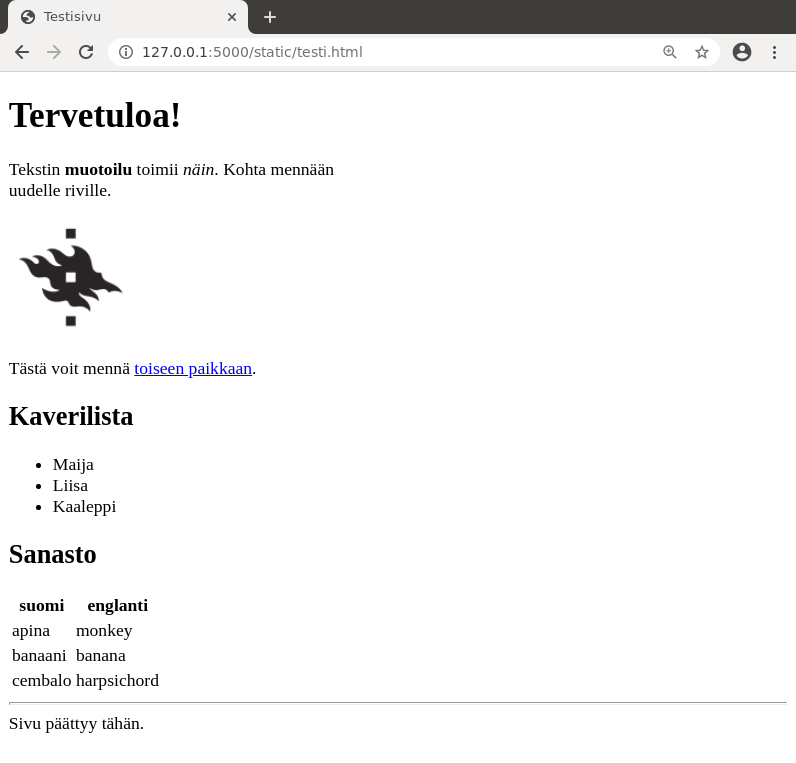
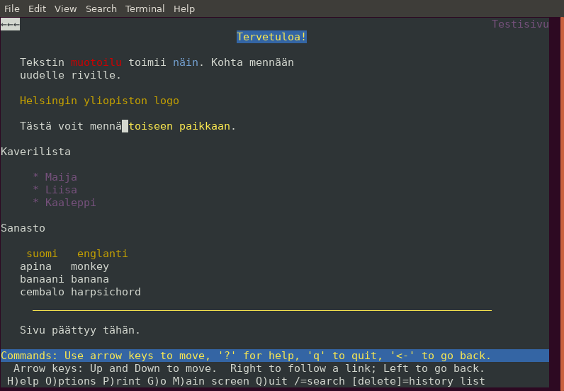

# HTML-opas

Tämä opas antaa perustiedot HTML-kielestä, jolla määritellään nettisivun rakenne. Lisäksi tutustumme lyhyesti CSS- ja JavaScript-kieliin.

Lisää tietoa aiheista löydät esimerkiksi [Mozillan ohjesivustolta](https://developer.mozilla.org/en-US/docs/Learn/HTML).

## HTML:n perusteet

HTML-sivu muodostuu elementeistä, jotka määrittelevät sivun sisällön. Esimerkiksi sivun otsikko tulee elementin `<title>` sisään ja elementti `` näyttää kuvan.

Tässä on esimerkkisivu `testi.html`, joka esittelee tavallisia HTML:n ominaisuuksia:

```html
<!DOCTYPE html>
<title>Testisivu</title>
<h1>Tervetuloa!</h1>
<p>
Tekstin <b>muotoilu</b> toimii <i>näin</i>.
Kohta mennään <br> uudelle riville.
<!-- Tämä kommentti ei näy sivun käyttäjälle -->
<p>

<p>
Tästä voit mennä <a href="https://cs.helsinki.fi/">toiseen paikkaan</a>.
<h2>Kaverilista</h2>
<ul>
  <li> Maija
  <li> Liisa
  <li> Kaaleppi
</ul>
<h2>Sanasto</h2>
<table>
  <tr><th>suomi</th><th>englanti</th></tr>
  <tr><td>apina</td><td>monkey</td></tr>
  <tr><td>banaani</td><td>banana</td></tr>
  <tr><td>cembalo</td><td>harpsichord</td></tr>
</table>
<hr>
Sivu päättyy tähän.
```

Sivu voi näyttää selaimessa seuraavalta:



Katsotaan seuraavaksi tarkemmin joitakin HTML-koodin osia.

### Dokumenttityyppi

Sivun alussa oleva dokumenttityyppi ilmaisee, että kyseessä on HTML-sivu:

```html
<!DOCTYPE html>
```

Itse asiassa tämä rivi on turha: jos rivin poistaa, sivu näkyy yhtä hyvin kuin ennenkin. Rivi kuitenkin vaaditaan, jotta sivu on _validi_ eli HTML-kielen standardin mukainen.

Toisin kuin ohjelmoinnissa, HTML:ää voi kirjoittaa huolettomasti ja selaimet koettavat näyttää sivun jotenkin järkevästi, vaikka koodissa olisi virheitä. Toisaalta on hyvä tavoite toimivuuden kannalta pyrkiä siihen, että sivu on ainakin lähellä validia.

Helppo tapa selvittää sivun validius on käyttää [validaattoria](https://validator.w3.org/).

### Tyhjä tila ja rivitys

HTML:ssä ylimääräinen tyhjä tila ja rivinvaihdot eivät vaikuta siihen, miten sivu näkyy selaimessa. Esimerkiksi seuraavat koodit tuottavat täysin saman tuloksen:

```html
apina banaani cembalo
```

```html
apina
    banaani
cembalo
```

Elementti `<p>` määrittää kappaleen ja elementti `<br>` tuottaa rivinvaihdon.

### Kuvien näyttäminen

Elementin `img` attribuutti `src` antaa osoitteen kuvatiedostoon ja attribuutti `alt` määrittää tekstin, joka voidaan näyttää kuvan sijasta:

```html

```

Esimerkiksi jos sivua katsoo Lynx-tekstiselaimella, kuvan sijasta näkyy teksti:



Vaihtoehtoinen teksti on myös hyödyllinen näkövammaisille käyttäjille, koska se voidaan lukea ääneen kuvan näyttämisen sijasta.

## Lomakkeet

Lomake on HTML-sivun osa, jonka avulla käyttäjä pystyy lähettämään tietoa web-sovellukselle. Esimerkiksi seuraava lomake sallii käyttäjän lähettää viestin:

```html
<form action="/send" method="POST">
Otsikko: <input type="text" name="title"> <br>
Viesti: <br>
<textarea name="message" rows="5" cols="40">
</textarea> <br>
<input type="submit" value="Lähetä">
</form>
```

<div style="border-style:solid;border-width:1px;padding:10px">
<form action="/send" method="POST">
Otsikko: <input type="text" name="title"> <br>
Viesti: <br>
<textarea name="message" rows="5" cols="40">
</textarea> <br>
<input type="submit" value="Lähetä">
</form>
</div>

Tutustumme seuraavaksi tavallisimpiin lomakkeen elementteihin.

### Tekstikenttä

Tekstikentän avulla voi kysyä yhden rivin tietoa käyttäjältä. Attribuutti `value` antaa kentän oletusarvon ja `size` määrittää kentän leveyden.

```html
Nimi: <input type="text" name="name" value="Mikki Hiiri" size="20">
```

<div style="border-style:solid;border-width:1px;padding:10px">
Nimi: <input type="text" name="name" value="Mikki Hiiri" size="20">
</div>

### Salasanakenttä

Salasanakenttä on tekstikenttä, joka on tarkoitettu salasanan kysymiseen. Kun käyttäjä kirjoittaa salasanan kenttään, se näkyy piilotettuna.

```html
Salasana: <input type="text" name="password" size="20">
```

<div style="border-style:solid;border-width:1px;padding:10px">
Salasana: <input type="password" name="password" size="20">
</div>

### Tekstilaatikko

Tekstilaatikon avulla käyttäjä voi syöttää pitkän tekstin, jossa voi olla useita rivejä. Attribuutit `rows` ja `cols` määrittävät laatikon koon. Laatikon oletussisältö kirjoitetaan elementin sisään.

```html
Viesti: <br>
<textarea name="message" rows="5" cols="40">
Ensimmäinen rivi
Toinen rivi
Kolmas rivi
</textarea>
```

<div style="border-style:solid;border-width:1px;padding:10px">
Viesti: <br>
<textarea name="message" rows="5" cols="40">
Ensimmäinen rivi
Toinen rivi
Kolmas rivi
</textarea>
</div>

### Valintanappi

Valintanapin avulla käyttäjä voi valita yhden vaihtoehdon useasta mahdollisesta. Attribuutti `value` määrittää valintaa vastaavan arvon, joka välitetään lomakkeen käsittelijälle.

Kun valintanapeilla on yhteinen nimi, niistä pystyy valitsemaan vain yhden. Attribuutti `checked` ilmaisee, mikä valinta on tehty oletuksena.

```html
Kieli: <br>
<input type="radio" name="lang" value="fi" checked> suomi
<input type="radio" name="lang" value="sv"> ruotsi
<input type="radio" name="lang" value="en"> englanti
```

<div style="border-style:solid;border-width:1px;padding:10px">
Kieli: <br>
<input type="radio" name="lang" value="fi" checked> suomi
<input type="radio" name="lang" value="sv"> ruotsi
<input type="radio" name="lang" value="en"> englanti
</div>

### Valintaruutu

Valintaruutu muistuttaa valintanappia, mutta käyttäjä voi tehdä minkä tahansa määrän valintoja (ja myös olla valitsematta mitään).

```html
Käyttöjärjestelmä: <br>
<input type="checkbox" name="os" value="1" checked> Linux
<input type="checkbox" name="os" value="2"> Mac
<input type="checkbox" name="os" value="3" checked> Windows
```

<div style="border-style:solid;border-width:1px;padding:10px">
Käyttöjärjestelmä: <br>
<input type="checkbox" name="os" value="1" checked> Linux
<input type="checkbox" name="os" value="2"> Mac
<input type="checkbox" name="os" value="3" checked> Windows
</div>

### Valintalista

Valintalista on toinen tapa antaa käyttäjän tehdä valinta. Valintalista on kätevä silloin, kun vaihtoehtoja on paljon, koska ne eivät vie tilaa sivulta.

Valintalistassa attribuutti `selected` ilmaisee oletuksena tehdyn valinnan.

```html
Kieli:
<select name="lang">
<option value="fi" selected> suomi
<option value="sv"> ruotsi
<option value="en"> englanti
</select>
```

<div style="border-style:solid;border-width:1px;padding:10px">
Kieli:
<select name="lang">
<option value="fi" selected> suomi</option>
<option value="sv"> ruotsi</option>
<option value="en"> englanti</option>
</select>
</div>

### Piilokenttä

Piilokenttä on lomakkeen osana oleva kenttä, joka ei näy sivun käyttäjälle mutta jonka arvo välitetään lomakkeen käsittäjälle. Esimerkiksi seuraava kenttä lähettää lomakkeen käsittäjälle tiedon, että kentän `id` arvona on `123`.

```html
<input type="hidden" name="id" value="123">
```

Huomaa, että vaikka käyttäjä ei näe piilokenttää sivulla, kenttä kuitenkin näkyy sivun lähdekoodissa eli piilokentässä ei voi olla salaista tietoa.

### Päivämäärä ja kellonaika

Päivämäärä ja kellonaika voidaan kysyä näin:

```html
Päivämäärä: <input type="date" name="date"> <br>
Kellonaika: <input type="time" name="time">
```

<div style="border-style:solid;border-width:1px;padding:10px">
Päivämäärä: <input type="date" name="date"> <br>
Kellonaika: <input type="time" name="time">
</div>

Oletuksena kellonajassa voidaan antaa tunnit ja minuutit muttei sekunteja. Jos halutaan myös sekunnit, tämä onnistuu attribuutin `step` avulla näin:

```html
Kellonaika: <input type="time" name="time" step="1">
```

### Tiedon validointi

Lomakkeen elementeille voidaan lisätä attribuuttien avulla validointia, jonka tarkoituksena on varmistaa, että käyttäjä antaa lomakkeen kautta oikeanlaista tietoa. Esimerkiksi tekstikentässä voidaan käyttää seuraavia attribuutteja:

* `required`: kenttä on pakko täyttää
* `minlength`: pienin sallittu merkkien määrä
* `maxlength`: suurin sallittu merkkien määrä
* `pattern`: säännöllinen lauseke, joka ilmaisee vaaditun tiedon muodon

Esimerkiksi seuraava tekstikenttä vaatii, että käyttäjän tunnuksessa on 1–16 merkkiä:

```html
Tunnus: <input type="text" name="name" minlength="1" maxlength="16">
```

Jos tiedon muoto ei ole oikea, selain huomauttaa asiasta eikä lähetä lomaketta. Huomaa kuitenkin, että osaava käyttäjä voi kiertää selaimen tarkastuksen, eli tiedon muoto tulee tarkastaa myös palvelimella selaimen validoinnista huolimatta.

## CSS

Ihanteena on, että HTML määrittelee sivun _rakenteen_: mitä tekstiä, kuvia, listoja, taulukoita, jne. sivulla on. Kuitenkaan HTML:n tehtävänä ei ole määritellä tarkemmin sivun _ulkoasua_: mikä on tekstin fontti, kuinka leveitä rivit ovat, mikä on sivun taustaväri, jne.

Usein kuitenkin sivun ulkoasu halutaan määritellä tarkemmin, ja tämä onnistuu lisäämällä sivulle CSS-koodia. Tämän avulla voidaan määritellä tyylejä, jotka vaikuttavat siihen, miten sivun HTML-elementit näkyvät selaimessa.

### Tyylien kokeilua

Yksinkertainen tapa määritellä HTML-elementin tyyli on käyttää `style`-attribuuttia. Esimerkiksi seuraava tyyli `color:red` määrittelee, että tekstin väri on punainen:

```html
Korissa on paljon <span style="color:red">mansikoita</span>.
```

<div style="border-style:solid;border-width:1px;padding:10px">
Korissa on paljon <span style="color:red">mansikoita</span>.
</div>

Tässä käytetty `span`-elementti ei itsessään tee mitään erityistä, mutta siihen voidaan kohdistaa tyylejä, jotka esimerkiksi muuttavat tekstin ulkoasua.

Tässä on monimutkaisempi esimerkki tyyleistä:

```html
<div style="background:blue;color:white;padding:10px;width:200px;height:50px">
Heipparallaa!
</div>
```

<div style="border-style:solid;border-width:1px;padding:10px">
<div style="background:blue;color:white;padding:10px;width:200px;height:50px">
Heipparallaa!
</div>
</div>

Nyt käytössä on `div`-elementti, joka määrittelee alueen, jota voidaan tyylitellä. Tässä tapauksessa tyylit ovat seuraavat:

* `background:blue`: alueen tausta on sininen
* `color:white`: tekstin väri on valkoinen
* `padding:10px`: alueen sisällä reunoilla on 10 pikseliä tyhjää
* `width:200px`: alueen leveys on 200 pikseliä
* `height:50px`: alueen korkeus on 50 pikseliä

### Yhteinen tyyli

Attribuuttia `style` on helppo käyttää CSS:n määrittelyyn, mutta tämä ei ole yleensä kovin hyvä ratkaisu. Ongelmana on, että jos usealla elementillä on tarkoitus olla sama tyyli, samanlaista CSS-koodia joutuu kopioimaan moneen paikkaan.

Parempi tapa on määritellä sivun alussa tyyliluokka, joka määrittelee yhteisen tyylin, ja viitata tähän halutuissa elementeissä. Esimerkiksi seuraava CSS-koodi määrittelee tyyliluokan `laatikko` sinistä laatikkoa varten:

```html
<style>
.laatikko {
    background: blue;
    color: white;
    padding: 10px;
    width: 200px;
    height: 50px;
}
</style>
```

Tämän jälkeen voimme määritellä laatikkoja näin `class`-attribuutin avulla:

```html
<div class="laatikko">apina</div> <br>
<div class="laatikko">banaani</div> <br>
<div class="laatikko">cembalo</div>
```

<div style="border-style:solid;border-width:1px;padding:10px">
<div style="background:blue;color:white;padding:10px;width:200px;height:50px" class="laatikko">apina</div> <br>
<div style="background:blue;color:white;padding:10px;width:200px;height:50px" class="laatikko">banaani</div> <br>
<div style="background:blue;color:white;padding:10px;width:200px;height:50px" class="laatikko">cembalo</div>
</div>

Vastaavasti voimme myös asettaa kaikille sivun HTML-elementeille tietyn tyylin. Esimerkiksi seuraava tyyli määrittelee, että sivun linkit ovat vihreitä eikä niissä ole alleviivausta:

```html
<style>
a {
    color: green;
    text-decoration: none;
}
</style>
```

Tämä tyyli vaikuttaa automaattisesti kaikkiin `a`-elementteihin:

```html
Tästä voit mennä <a href="https://cs.helsinki.fi/">toiseen paikkaan</a>.
```

<div style="border-style:solid;border-width:1px;padding:10px">
Tästä voit mennä <a style="color:green;text-decoration:none" href="https://cs.helsinki.fi/">toiseen paikkaan</a>.
</div>

### Tyylitiedosto

Usein monilla sivuilla on samanlainen tyyli, jolloin on kätevää luoda yhteinen tyylitiedosto, johon viitataan sivuilla. Esimerkiksi seuraava tiedosto `tyyli.css` määrittelee tyylin laatikkoa varten:

```css
.laatikko {
    background: blue;
    color: white;
    padding: 10px;
    width: 200px;
    height: 50px;
}
```

Tämän jälkeen tyylitiedoston voi ottaa mukaan näin HTML-tiedostossa:

```html
<link rel="stylesheet" href="tyyli.css">
```

## JavaScript

JavaScript on ohjelmointikieli, jonka avulla HTML-sivulle voidaan lisätä selaimessa tapahtuvia toimintoja. Esimerkiksi käyttäjälle voidaan näyttää viestejä eri tilanteissa ja sivun sisältöä voidaan muuttaa käyttäjän toimien perusteella.

JavaScriptin historia on poikkeuksellinen ohjelmointikielten joukossa. Vuosituhannen vaihteessa kieli oli lähinnä vitsi ja sen maine oli kyseenalainen, minkä vuoksi monet käyttäjät estivät kokonaan sen käyttämisen. JavaScript on kuitenkin kehittynyt paljon niistä ajoista, ja nykyään kielellä on vahva asema web-sovellusten toteutuksessa.

### Esimerkkejä

Seuraavassa on JavaScript-funktio `hello`, joka näyttää viesti-ikkunan funktiolla `alert`. Funktio aktivoituu `onclick`-tapahtumasta, kun käyttäjä painaa sivulla olevaa nappia.

```html
<script>
function hello() {
    alert("Heipparallaa!");
}
</script>
<button onclick="hello()">Paina tästä</button>
```

Voit kokeilla koodin toimintaa tästä:

<div style="border-style:solid;border-width:1px;padding:10px">
<script>
function hello() {
    alert("Heipparallaa!");
}
</script>
<button onclick="hello()">Paina tästä</button>
</div>

Seuraavassa koodissa laskurin arvo kasvaa, kun käyttäjä painaa napista. Laskurin arvo on tallessa JavaScriptin puolella muuttujassa `value`. Funktion `getElementById` avulla pääsee käsiksi HTML-elementtiin, kun sille on annettu `id`-attribuutti.

```html
<script>
var value = 0;

function increase() {
    value++;
    document.getElementById("counter").innerText = value;
}
</script>
Laskuri: <span id="counter">0</span> <br>
<button onclick="increase()">Kasvata</button>
```

<div style="border-style:solid;border-width:1px;padding:10px">
<script>
var counter = 0;

function increase() {
    counter++;
    document.getElementById("counter").innerText = counter;
}
</script>
Laskuri: <span id="counter">0</span> <br>
<button onclick="increase()">Kasvata</button>
</div>

### Milloin käyttää JavaScriptiä?

JavaScript on nykyään todella monipuolinen kieli, ja sen avulla voi toteuttaa lähes mitä tahansa selaimessa suoritettavaa. Mutta kannattaako sitä käyttää?

Ennen vanhaan yleinen periaate oli, että hyvän web-sovelluksen täytyy toimia täysin ilman JavaScriptiä. Tähän vaikutti se, että moni ei sallinut JavaScriptin käyttämistä ja lisäksi eri selainten välillä oli merkittäviä eroja JavaScriptin toiminnassa. Ajat ovat kuitenkin muuttuneet, ja nykyään JavaScript toimii luotettavasti lähes kaikilla käyttäjillä.

Siitä huolimatta edelleen on hyvä tavoite toteuttaa sovelluksen oleelliset toiminnot ilman JavaScriptiä eikä käyttää sitä turhaan. JavaScript on kuitenkin kätevä esimerkiksi lomakkeen tietojen tarkastamisessa: jos tiedot eivät ole kelvollisia, tämä voidaan ilmoittaa käyttäjälle selaimessa ennen lomakkeen lähetystä. Tässä JavaScript parantaa sovelluksen käytettävyyttä mutta ei kuitenkaan ole välttämätön.
